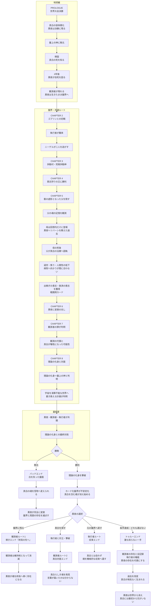

# ストーリー構成図

物語の詳細は[ストーリー全貌.md](./ストーリー全貌.md)を正本とし、このファイルは章構成と分岐を俯瞰するための図とする。章構成、出来事の順序、分岐条件、エンディングを変更する場合は、正本とこの図を同時に更新する。

```mermaid
flowchart TD
    subgraph EARTH["地球編"]
        A["PROLOGUE<br/>世界大会決勝"] --> B["真白の容体悪化<br/>黒夜は決勝に残る"]
        B --> C["盤上の神に敗北"]
        C --> D["帰国<br/>真白の死を知る"]
        D --> E["4年後<br/>黒夜が自死を図る"]
        E --> F["観測者が現れる<br/>黒夜は生きたまま盤界へ"]
    end

    subgraph BANKAI["盤界・共通ルート"]
        F --> G["CHAPTER 2<br/>ゴブリンとの初戦"]
        G --> H["執行者が襲来"]
        H --> I["ニーゲルが二人を逃がす"]
        I --> J["CHAPTER 3<br/>多動村・究極多動神"]
        J --> K["CHAPTER 4<br/>意志狩りの王に勝利"]
        K --> L["CHAPTER 5<br/>骸の虚影となった父を倒す"]
        L --> M["父の魂の記憶を観測"]

        M --> M1["母は回想内だけに登場<br/>黒夜へリバーシを教えた過去"]
        M1 --> M2["母の死後<br/>父が真白の治療へ固執"]
        M2 --> M3["過労・焦り・人間性の低下<br/>病院へ向かうが間に合わない"]
        M3 --> N["出稼ぎの意志・救済の意志を獲得<br/>戦闘用カード"]

        N --> O["CHAPTER 6<br/>黒夜に変貌の兆し"]
        O --> P["CHAPTER 7<br/>観測者の罪が判明"]
        P --> Q["観測の代償と<br/>真白が犠牲になった可能性"]
        Q --> R["CHAPTER 8<br/>理論の化身と対面"]
        R --> S["理論の化身＝盤上の神と判明"]
        S --> T["宇宙を演算不能な世界へ<br/>書き換える計画が判明"]
    end

    subgraph FINAL["最終章"]
        T --> U["黒夜・観測者・執行者が共闘"]
        U --> V["理論の化身との最終対局"]
        V --> W{"勝敗"}
    end

    W -->|"敗北"| BAD["バッドエンド<br/>白を失った盤面"]
    BAD --> BAD2["真白の魂を怪物へ変えられる"]
    BAD2 --> BAD3["黒夜が完全に変貌<br/>盤界と周囲の存在を滅ぼす"]

    W -->|"勝利"| WIN["理論の化身を撃破"]
    WIN --> COLLAPSE["カード化盤界が不安定化<br/>真白を含む魂が消え始める"]
    COLLAPSE --> SELECT{"黒夜の選択"}

    SELECT -->|"盤界に残る"| END1["観測者ルート1<br/>導きエンド『終局の先へ』"]
    END1 --> END1A["観測者は維持核となって消滅"]
    END1A --> END1B["黒夜が魂を終局へ導く存在になる"]

    SELECT -->|"真白を探す"| END2B["執行者と対立・撃破"]
    END2B --> END2["観測者ルート2<br/>真白対面エンド"]
    END2 --> END2A["真白らしき魂を発見<br/>言葉が届いたかは分からない"]

    SELECT -->|"元の盤界へ戻す"| END3["執行者ルート<br/>収束エンド"]
    END3 --> END3A["真白とは会わず<br/>魂を機械的な収束へ還す"]

    SELECT -->|"条件達成：どれも選ばない"| TRUE["トゥルーエンド<br/>誰も知らない一手"]
    TRUE --> TRUE1["観測者の存在と全記録<br/>執行者の権能<br/>黒夜の存在を代償にする"]
    TRUE1 --> TRUE2["過去を改変<br/>真白が病気なく生まれる"]
    TRUE2 --> TRUE3["黒夜は世界から消え<br/>真白には最初から兄がいない"]
```

現行構成では、理論の化身との決着までは共通ルートであり、分岐は最終対局の勝敗と勝利後の選択で発生する。未採用の構想は図へ含めない。
