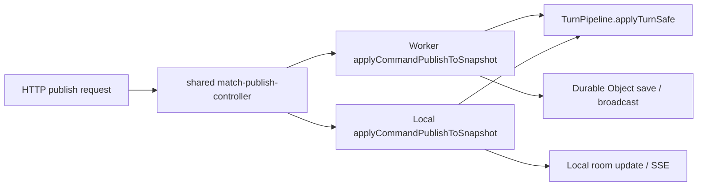
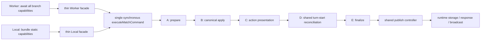

# Worker／ローカル共通コマンド実行 統合設計

## 文書の役割

- Status: reviewed design; implementation not started
- Date: 2026-07-28
- 対象: `workers/match-worker.ts` と `scripts/local-match-server.ts` に重複している canonical match command 実行
- 内部契約の一次情報: `docs/architecture-contracts.md`
- ゲーム仕様の一次情報: `01-rulebook.md` と関連する `正本/*.md`
- 実装手順: `docs/implementation/match-command-runtime-unification-plan.md`
- 非対象: プレイヤー向けルール変更、カード効果変更、UI変更、ネットワークAPI変更、履歴書き換え

## 1. 結論

`workers/match-worker.ts` と `scripts/local-match-server.ts` に残る `applyCommandPublishToSnapshot()` の canonical command 実行を、既存の `utils/match-command-runtime.ts` を正本とする段階APIへ統合する。

共通化するのは、コマンドの準備、authority PRNG 復元、ターン適用、pending 結果検証、action playback/effect log 組み立て、turn-start 結果との合成、最終結果生成である。Worker 固有の非同期モジュール読込、Durable Object 永続化、SSE 配信と、ローカルサーバー固有の Node HTTP 処理は共通化しない。

ローカルの同期 `applyCommandPublishToSnapshot()` と `scripts/local-match-runtime.ts` の同期APIを維持するため、共通実装を一つの常時 `async` 関数にはしない。Worker adapterはcommand branchに必要な全moduleをauthority mutation前に解決し、その後はlocalと同じ単一の同期`executeMatchCommand()`を呼ぶ。A〜Eの順序はこの関数だけが所有し、adapterは段階間をorchestrateしない。

実装後も両 runtime の `applyCommandPublishToSnapshot()` export は互換 facade として残せるが、ゲーム結果を決定する処理本体を持ってはならない。

## 2. 問題と期待結果

### 2.1 現在の問題

現行コードでは、外側の publish 契約は `utils/match-publish-controller.ts` に統合されている。認証、seat token、`operationId`、base version、idempotent replay、authority log、state version commit、永続化、broadcast は同じ controller を通る。

一方、その controller から注入される `applyCommandPublishToSnapshot()` は次の2か所に独立した実装を持つ。

- `workers/match-worker.ts`
- `scripts/local-match-server.ts`

2026-07-28 の調査時点では次の状態だった。

- 両ファイルに同名のトップレベル関数が72個ある。
- それらの関数本体は両側合計約2,138行ある。
- `applyCommandPublishToSnapshot()` だけで Worker 246行、local 214行、合計460行ある。
- 同関数の5-token構造比較では、Worker側の約65%、local側の約77%が相互に一致する。
- `npm run checkall` と `npm run test:match:parity` は通るが、検査は二つの authority body が将来同時に直されることを保証しない。
- `docs/architecture-contracts.md` §13 も、Worker／local 間に network contract logic の重複が残ることを既知の負債としている。

重複している主な処理は次のとおりである。

1. snapshot clone と transient state 除去
2. network debug hand fill
3. `auto_turn` の canonical action 解決
4. schema、seat、pending instance の検証と action sanitize
5. serialized PRNG state の復元と derived seed fallback
6. sub-placement／pending selection の turn-start skip 判定
7. `TurnPipeline.applyTurnSafe()`
8. authoritative pending selection result 検証
9. action playback、presentation events、effect log の組み立て
10. post-action turn-start reconciliation
11. action と turn-start の playback/effect log 合成
12. transient presentation state 除去と command result 生成
13. timeout command resolver不在時のlegacy `Core.applyPass()`／独自turn-start fallback

### 2.2 期待結果

- canonical command の結果を決める各段階の実装が一か所だけにある。
- Worker と local は同じ同期`executeMatchCommand()`を呼び、runtime 固有のmodule解決方法だけを外側に残す。
- 同じ snapshot、command、seed、capability を与えた場合、成功／拒否、次状態、ordered raw events、playback、effect log、pending identity が一致する。
- Worker の module preload 失敗は既存の fail-closed error code を維持し、canonical stateを変更する前に終端する。
- local runtime の同期呼び出し契約を維持する。
- `utils/match-publish-controller.ts`、`utils/match-authority.ts`、`game/turn/turn_pipeline.ts` の既存責務を奪わない。
- Worker／local adapter に `TurnPipeline.applyTurnSafe()` や pending result validation の重複 body を再追加できない構造テストを置く。

## 3. スコープ

### 3.1 対象

- `utils/match-command-runtime.ts` の canonical command execution authority 化
- `utils/match-runtime-ports.ts` の typed command DTO／capability 契約
- `utils/match-runtime-core.ts` と旧generic command portの削除
- `utils/match-authority/projection.ts` のtransient charge hash除外
- `workers/match-worker.ts` の command adapter 薄型化
- `workers/match-worker-timeout-controller.ts` のlegacy direct-pass fallback削除
- `scripts/local-match-server.ts` の command adapter 薄型化
- `scripts/local-match-runtime.ts` の同期互換確認
- command execution の focused tests、Worker/local parity tests、source authority guard
- `docs/architecture-contracts.md` の既知負債更新
- build後の Worker mirror 同期と検証

### 3.2 非対象

- `utils/match-publish-controller.ts` の認証、version、commit、保存、配信順序の再設計
- create/join/leave/chat/rating/leaderboard/room-list の統合
- 両ファイルにある72個すべての同名関数の一括移動
- Worker と local のHTTP／storage／stream adapter の統一
- `TurnPipeline`、カード効果、CPU policy、pending selection の仕様変更
- snapshot、publish payload、SSE、presentation journal の公開shape変更
- UI、盤面描画、音、アニメーション、表示文言の変更
- `worker-public/`、`dist/`、generated registry の直接編集
- Git history の書き換え

72個の同名関数は再監査対象として記録するが、本設計は player action、AUTO、timeout pass が通る command execution cluster のみを閉じる。routeやroom lifecycleまで同時に動かすと、検証単位が大きくなり、既に共通化済みの publish controller と責務が混ざるためである。

## 4. 前提と実装開始条件

- 本設計は挙動維持リファクタであり、`01-rulebook.md` と `正本/*.md` は変更しない。
- 調査時の作業ツリーには火・草・水の意志、演出、Pixi、generated／mirror にまたがる未コミット変更がある。
- 実装は、その作業が完了して作業ツリーがクリーンになるまで開始しない。
- 実装開始時に現在の `HEAD` から baseline を取り直す。本文の行数と重複率は問題の根拠であり、将来の固定期待値ではない。
- Worker source、local source、shared source、tests は root が正本である。`worker-public/` は generator経由でのみ更新する。
- runtime-specific bootstrapping は許されるが、runtime-specific gameplay outcome は許されない。

## 5. 現在の責務境界

現行の publish flow は概ね次の順である。



このうち `shared match-publish-controller` は外側の authority transaction を既に所有している。今回の問題は、controller が呼ぶ command port の内側が二つの実装になっていることである。

既存の再利用対象は次のとおりである。

- `utils/match-command-runtime.ts`
  - `prepareMatchCommandAction()`
  - `shouldSkipMatchCommandTurnStart()`
  - debug option validation
- `utils/match-auto-command.ts`
  - `isMatchAutoTurnPublishBody()`
  - `resolveMatchAutoTurnPublishBody()`
- `utils/match-authority.ts`
  - player normalization
  - pending publish/result validation
  - PRNG seed derivation
  - playback/effect log helpers
  - transient state cleanup
- `shared/playback-event-helpers.ts`
  - action/turn-start playback assembly
  - ordered append
- `utils/match-publish-controller.ts`
  - publish acceptance、commit、projection、persistence、delivery

新しい二つ目の authority module は作らず、`utils/match-command-runtime.ts` を拡張する。

## 6. 選択肢

### 6.1 現状維持＋parity test追加

利点は変更リスクが最小であること。欠点は、canonical body が二つある根本原因を残し、テストが未収録の新しい分岐では先にdriftが発生することである。採用しない。

### 6.2 一つの常時async executorへ統合

Workerには自然だが、local serverと`local-match-runtime`の同期APIがPromise化する。selfplay、focused tests、CLI consumerまで不要に変更するため採用しない。

### 6.3 Worker sourceからlocal sourceを生成

コード本体を一つにできるが、runtime差を生成条件へ隠し、source reviewとTypeScript型検査を難しくする。root source／generated outputの境界も増えるため採用しない。

### 6.4 事前module解決＋単一同期executor

canonical処理を一つの同期`executeMatchCommand()`が所有し、その内部を同期stageへ分ける。Workerはentry前に必要な非同期module resolutionをすべて終え、localはstatic moduleを同じcapability shapeへ束ねる。

既存のsync契約を維持し、runtime差をouter wiringへ限定できるため、この方式を採用する。

## 7. 選択設計

### 7.1 目標構造



### 7.2 single entryとshared stage

production adapterが呼ぶpublic entryは、同期`executeMatchCommand(context, body, capabilities)`一つにする。この関数が次の段階を必ずA→B→C→D→Eの順で実行する。個別stageはunit test用にexportしてもよいが、Worker/local production adapterは個別stageを組み立ててはならない。

Worker adapterはbranch別preload表に従って必要moduleをentry前にすべて解決する。turn-startの要否はcanonical apply後まで確定しないため、debug fill以外のnormal commandではturn-start capabilityも常に事前解決する。debug fillのterminal branchだけはpipeline／turn-startを必要としない。

`utils/match-command-runtime.ts` は次の段階を所有する。

#### Stage A: prepare

入力:

- `MatchCommandAuthorityContext`
- publish body
- resolved capability groups

処理:

1. 現在の分岐に必須のcapabilityを検査し、不足時は既存error codeでfail closedにする。runtime起動時のmodule可用性preflightと、そのerror precedenceはadapterが互換性として維持する。
2. `validateCanonicalMatchCommandSnapshot()`でprojection metadataと両seatのhandを検査し、公開projectionなら`INVALID_SNAPSHOT`で終端する。
3. contextのcanonical snapshotをcloneする。
4. stale `chargeDeltaEvents`だけを除去する。presentation stateは現行順序どおり、turn-start直前とfinalizeで除去する。
5. debug fill commandならshared debug stageで終端結果を作る。
6. `auto_turn`なら注入されたplanner capabilityを通し、canonical bodyへ変換する。
7. `prepareMatchCommandAction()`でschema、actor、debug options、pending instanceを検証する。
8. serialized PRNG stateを復元し、復元不能時だけcontextの`roomSeed`、`stateVersion`とsnapshotから導出したseedを使う。
9. turn-start skip条件を決める。

出力:

- terminal rejection/debug result、または
- executor内部だけが所有する`PreparedMatchCommandExecution`

#### Stage B: canonical apply

処理:

1. `TurnPipeline.applyTurnSafe()`を一度だけ呼ぶ。
2. pipeline rejectionのreason、message、raw eventsを保存する。
3. `validateAuthoritativePendingSelectionResult()`を一度だけ呼ぶ。
4. `nextSnapshot`、resolved action、pending identity、raw eventsを`AppliedMatchCommandExecution`へまとめる。

このstageがgameplay outcomeの正本である。Worker/local adapterは`applyTurnSafe()`を直接呼ばない。

#### Stage C: action presentation

処理:

1. action raw eventsからplayback/presentation eventsを組み立てる。
2. action effect logsを組み立てる。
3. playback diagnosticsを記録可能なDTOへする。
4. `restoreMissingChargeDeltaEvents(preActionSnapshot, nextSnapshot)`を一度適用し、turn-start前のaction delta queueをDTOへ退避する。
5. post-action playerとskip条件からturn-start reconciliationの要否を決める。

このstageはordered eventを変更せず、canonical stateを判断しない。

#### Stage D: shared turn-start reconciliation

`executeMatchCommand()`はStage Cが要求した場合だけ、注入済みの同期turn-start capability群を使ってturn-start reconciliationを実行する。

- turn-start前hand stateのcapture
- turn-start直前のtransient presentation state除去
- last-started playerとcurrent playerの比較
- game-over判定
- typed initial deck／board optionによるcard state normalization
- serialized PRNG復元／derived seed fallback
- `TurnPipelinePhases.applyTurnStartPhase()`
- PRNG state保存
- raw turn-start events
- turn-start playback／effect logs／draw playback

game ruleは既存の`TurnPipelinePhases`／`CardLogic` authorityに残すが、上記のreconciliation orchestrationはshared stageだけが持つ。adapterは結果を再計算せず、Workerもこのstage内で`await`しない。

module不在時のerror precedenceは、通常のgameplay outcomeではなくruntime boot／availability契約である。現状のlocal adapterはschema、pipelineをcommand body処理前に確認し、Worker adapterのdebug fill branchはpipelineを必要としない。この差をshared entryが暗黙に変えないよう、adapter preflightは残し、shared側は実際に通るbranchが必要とするcapabilityだけを検査する。将来このprecedence自体を統一する場合は、別の公開contract変更として扱う。

#### Stage E: finalize

処理:

1. action playbackへturn-start playbackを既存順序でappendする。
2. action effect logsへturn-start logsを既存順序でappendする。
3. turn-start後のcharge delta queueが空になった場合だけStage Cの退避queueを戻し、非emptyならturn-start後queueをそのまま保つ。
4. transient presentation stateを除去する。
5. success resultを構築する。

success resultは少なくとも次を持つ。

- `ok`
- `snapshot`
- `rawEvents`
- `playbackEvents`
- `playbackDiagnostics`
- `effectLogs`
- `action`
- `pendingEffectId`

failure resultは少なくとも次を持つ。

- `ok`
- `rejectedReason`
- 必要な場合の`errorMessage`
- 現在の直接consumerが必要とする場合だけ`events`／`pendingEffectId`

shared internal resultはsupersetを持ち、Worker/local facadeで次の既存shapeを維持する。

| 経路 | normal success | debug fill success | pipeline rejection |
| --- | --- | --- | --- |
| shared internal | snapshot、raw events、playback、diagnostics、logs、action、pending ID | 同じshapeでdebug actionあり | reason、message、raw events |
| Worker facade | 現行公開shapeどおり`rawEvents`を省略 | `action`を保持 | `events`を保持 |
| local server facade | 現行公開shapeどおり`rawEvents`を省略 | 現行どおり`action`を省略 | 現行どおり`events`を省略 |
| local runtime public result | publish payloadだけを公開 | publish payloadだけを公開 | publish rejection payloadだけを公開 |

`playbackDiagnostics`は現行どおりaction assembly分だけを返す。turn-start diagnosticsはreport対象にはするが、返却diagnosticsへ結合しない。

### 7.3 capability grouping

genericな巨大`deps` objectを作らず、消費責務ごとに能力を分ける。

```ts
interface MatchCommandExecutionCapabilities {
  snapshot: MatchCommandSnapshotCapabilities;
  schema: MatchCommandSchemaCapabilities;
  autoCommand: MatchAutoCommandCapabilities;
  debug: MatchCommandDebugCapabilities;
  random: MatchCommandRandomCapabilities;
  pipeline: MatchCommandPipelineCapabilities;
  turnStart: MatchCommandTurnStartCapabilities;
  authority: MatchCommandAuthorityCapabilities;
  presentation: MatchCommandPresentationCapabilities;
}
```

authority inputはraw roomではなく、次のminimum contextに固定する。

```ts
interface MatchCommandAuthorityContext {
  snapshot: MatchCommandSnapshot;
  playerKey: 'black' | 'white';
  roomSeed: number;
  stateVersion: number;
  initialDeckOptions: MatchCommandInitialDeckOptions;
  networkDebugEnabled: boolean;
  networkAutoEnabled: boolean;
}

interface MatchCommandInitialDeckOptions {
  initialDeckCardIdsByPlayer?: MatchCommandSeatMap<readonly string[]>;
  initialDeckSpecByPlayer?: MatchCommandSeatMap<unknown>;
  initialDeckSpec?: unknown;
  boardConfig?: unknown;
}

type MatchCommandPrepareResult =
  | { kind: 'terminal'; result: MatchCommandExecutionResult }
  | { kind: 'prepared'; value: PreparedMatchCommandExecution };

interface TurnStartReconciliationResult {
  snapshot: MatchCommandSnapshot;
  rawEvents: readonly unknown[];
  playbackEvents: readonly unknown[];
  presentationEvents: readonly unknown[];
  effectLogs: readonly string[];
  diagnostics: unknown | null;
  playerKey: 'black' | 'white' | null;
}
```

`playerKey`はouter authority layerが認証、seat、FATE controlを解決したauthority identityである。bodyの`actor`、`playerKey`、paramsから再導出してはならない。schema actionのactorはcontextの`playerKey`と照合する。

各groupは使用する関数だけを持つ。`turnStart` groupは、事前解決済みの`Core.isGameOver`、`CardLogic.createCardState`、`TurnPipelinePhases.applyTurnStartPhase`、`SeededPRNG`とpresentation adapterを持ち、Promiseを返す関数を含めない。Worker module全体、local server instance、汎用`globalThis`、Node request、Durable Object state、seat token、storage、streamを渡してはならない。

`utils/match-runtime-ports.ts` はDTOとcapability interfaceを所有し、実装をimportしない。

### 7.4 adapter責務

#### Worker adapter

残す責務:

- Worker preload registryの検証
- dynamic importとmodule cache
- 既存順序どおりのmodule可用性preflightとfail-closed error projection
- Worker固有型からshared DTOへの変換
- normal commandに必要なpipeline／presentation／turn-start moduleをauthority mutation前にすべて解決する
- shared resultを`match-publish-controller`へ返す

削除する責務:

- action build／pending validation本体
- PRNG restore body
- direct `TurnPipeline.applyTurnSafe()`
- authoritative pending result validation
- action playback／effect log assembly
- action/turn-start append
- success result body

#### Local adapter

残す責務:

- static CommonJS moduleをcapabilityへ束ねる
- 既存順序どおりのmodule可用性preflightとfail-closed error projection
- shared resultを同期的に返す

削除する責務はWorker adapterと同じである。

#### Branch別preload

| branch | entry前に必要なcapability | 不要 |
| --- | --- | --- |
| regular place/use/pass | schema、pipeline、PRNG、presentation、turn-start | AUTO planner、DebugActions |
| `auto_turn` | schema、AUTO planner群、pipeline、PRNG、presentation、turn-start | DebugActions |
| debug fill terminal | schema、DebugActions | AUTO planner、pipeline、PRNG、presentation、turn-start |
| debug option付きcanonical use-card | schema、pipeline、PRNG、presentation、turn-start | AUTO planner、DebugActions |
| timeout force-pass | schema、pipeline、PRNG、presentation、turn-start | AUTO planner、DebugActions |

ordinary commandがAUTO planner不在で失敗してはならない。preload失敗は、schema=`COMMAND_SCHEMA_UNAVAILABLE`、pipeline／turn-start／presentation=`COMMAND_PIPELINE_UNAVAILABLE`、AUTO planner群=`AUTO_COMMAND_PLANNER_UNAVAILABLE`、debug fill module=`DEBUG_ACTIONS_UNAVAILABLE`へprojectし、canonical snapshotを変更しない。

timeout force-passもregular commandと同じshared executorだけを通す。local timeout pathと`workers/match-worker-timeout-controller.ts`からlegacy `Core.applyPass()`／独自turn-start fallbackを削除する。timeout controllerはresolver可用性をrefresh/saveより前に検査し、resolverまたは必要capabilityがなければ、state version、snapshot、timer authorityを変更する前に`applied: false`でfail closedにする。

### 7.5 projected hidden-handの境界

productionの`room.snapshot`はcanonicalであり、どちらのhandにもhidden tokenを含んではならない。公開projectionをcanonical roomへ戻すことは禁止する。

`repairNetworkDebugProjectedHandForCardUse()`は削除し、Worker production adapterではrepairしない。いずれかのhandがhidden tokenなら、debug optionsの有無にかかわらずcanonical precondition違反として`INVALID_SNAPSHOT`でfail closedにする。

canonical検査はWorker adapterではなくshared Stage Aの`validateCanonicalMatchCommandSnapshot()`だけが所有する。次のいずれかなら両runtimeとも`INVALID_SNAPSHOT`を返す。

- `_meta.projectedForSeat`または`_meta.viewerRole`を持つviewer projection
- black／whiteいずれかのhandに`MatchAuthority.parseHiddenHandToken()`で解釈できるplaceholderがある

現行test/debug harnessが公開projectionをroomへ再投入している場合は、harness側を同じcanonical snapshotから開始する形へ直す。raw bodyからrepair要否を推定する処理、schema action buildの複製、repair hookをproduction adapterへ残さない。

### 7.6 `MatchRuntimeCore`の扱い

`utils/match-runtime-core.ts` と `executeMatchRuntimeCommand()`／`MatchCommandRuntimePort` は、現在`applyCommandPublishToSnapshot` callbackをforwardするだけで、canonical処理を所有していない。production consumerは`scripts/local-match-runtime.ts`に限定される。

本リファクタでは次のように確定する。

1. `scripts/local-match-runtime.ts`はthin local facadeの`applyCommandPublishToSnapshot()`を直接同期呼出しする。
2. 関連testを新しいsingle executor／local facade contractへ移す。
3. `utils/match-runtime-core.ts`、`executeMatchRuntimeCommand()`、`MatchCommandRuntimePort`を削除する。
4. browser／Vite module registryはgeneratorで更新する。

callback差し替え可能な第二authority入口は残さない。

## 8. authority・状態・順序の不変条件

次の値と順序をrefactor前後で一致させる。

- `TurnPipeline.applyTurnSafe()`へ渡すcard state、game state、player、action、PRNG state、options
- PRNG seed、calls、消費回数
- action acceptance／rejection reason
- raw `events[]` の値と順序
- pending instanceと`pendingEffectId`
- sub-placement／pending selection中の`skipTurnStart`
- action後のcurrent player判定
- turn-start reconciliation実行有無
- action playbackの後にturn-start playbackを置く順序
- effect logの値と順序
- charge deltaの一時保持と公開snapshot復元
- transient presentation stateの除去時点
- Worker/localのstate version commit前後関係

shared executorはstate versionをcommitしない。version increment、board contract validation、authority hash、operation history、save、broadcastは既存`match-publish-controller`の責務に残す。

### 8.1 charge delta ownership

`chargeDeltaEvents`はcanonical gameplay stateではなく、一回のaccepted commandを提示するためのtransient artifactである。ownershipを次に固定する。

- shared Stage A/C/E: stale pre-command queueを除去し、Stage Cで今回action deltaを確定・退避し、Stage Eでturn-startを通じた最終delta queueを返す。
- publish controller: delta入りsnapshotからviewer projection／presentation artifact／accepted responseを作り、その後canonical `room.snapshot`のqueueを除去してsave／次commandへ渡す。
- local runtime facade: delta入りpublic responseをcloneしてからcanonical `room.snapshot`のqueueを除去する。
- Worker/localとも`includePreviousSnapshotForChargeDelta`を`false`にする。accepted commandでpre-command deltaを復元しない。
- idempotent replayはcanonical snapshotへdeltaを戻さない。既存presentation frame／ack契約で再送する。

| ケース | shared result | public accepted/replay response | 永続／次command用canonical snapshot | hash |
| --- | --- | --- | --- | --- |
| rejected command | snapshotを返さない | 新規deltaなし | 変更なし、stale queueなし | pre-command hashを維持 |
| accepted・charge変化なし | `[]` | `[]` | `[]` | response／canonicalで一致 |
| accepted・actionでcharge変化 | 今回action delta | 今回action delta | response/artifact生成後に`[]` | delta有無をhash入力から除外し一致 |
| accepted・turn-startあり | action後queueを保持し、turn-startが非empty queueを返せばそのqueue、空へした場合は退避action queue | finalize後の今回queue | response/artifact生成後に`[]` | delta有無をhash入力から除外し一致 |
| idempotent replay | executorを再実行しない | 既存ack／presentation契約。pre-command deltaは復元しない | `[]` | accepted versionのhashを維持 |
| direct local runtime accepted | 今回queue | return用public cloneに今回queue | return前に`[]` | cleanup前後で同一 |
| timeout force-pass | 通常commandと同じ | 今回queueまたは`[]` | response/artifact生成後に`[]` | delta有無をhash入力から除外し一致 |

`restoreMissingChargeDeltaEvents()`はshared Stage Cでpre-action→post-actionの不足を補う用途に一度だけ使う。publish payload builderとdirect local runtimeはprevious snapshotからdeltaを再構築しない。

`utils/match-authority/projection.ts`のcanonical／projected hash source cloneは、`cardState.chargeDeltaEvents`を必ず`[]`としてからhashする。同一state versionでdelta-bearing accepted responseとdelta-free recovery snapshotを受けても、canonical hash／`projectedSnapshotHash`は同じでなければならない。`room.authoritativeStateHash`はcleanup後snapshotを再計算しても同じ値になる。

## 9. failure・edge case

focused coverageで最低限固定する。

- action schema module不在
- pipeline module不在
- invalid/missing snapshot
- network debug disabled／invalid debug options
- debug fill module不在／fill失敗
- projection metadataまたはいずれかのhidden handを含むsnapshotが両runtimeで`INVALID_SNAPSHOT`になるpath
- network AUTO disabled
- AUTO planner不在／例外／actionなし
- seat mismatch
- stale pending selection／invalid target
- corrupted serialized PRNG state
- sub-placement active
- pending selection stateあり
- pipeline rejectionとraw events
- invalid authoritative pending result
- action後も同playerが継続する場合
- playerが変わりturn-start reconciliationする場合
- turn-start eventなし／複数event
- charge deltaがturn-start処理で消える場合
- playback assembly diagnosticsあり／なし
- timeout force-pass
- timeout resolver／capability不在
- game over前後

missing capabilityに対し、ambient global探索や成功形fallbackを追加してはならない。

## 10. compatibility

- `applyCommandPublishToSnapshot()`のWorker/local export名を維持する。
- `scripts/local-match-runtime.ts`の`applyCommand()`は同期returnを維持する。
- HTTP status、publish payload、`rejectedReason`、`publishMeta`を変更しない。
- `worker-public/`のentryやruntime preload keyを変更する場合は、root registryを先に変更しgeneratorで反映する。
- classic browserやUIはcommand executorを直接authorityとして使用しない。
- existing testsが直接内部resultを検査している場合は、baseline fixtureでshapeを固定する。

## 11. security・concurrency・performance

### Security

- seat token、operation ID、version、FATE controlの検証はshared publish controllerに残す。
- debug optionのallowlistを広げない。
- projection metadataまたはいずれかのcanonical handにhidden tokenがあればnetwork debug enabledでも`INVALID_SNAPSHOT`で拒否する。
- private handやseat tokenをdiagnosticsへ追加しない。

### Concurrency

- Durable Objectのsingle-threaded sequencing、save順、broadcast順を変更しない。
- shared executor内で新しいtimer、microtask、retryを作らない。
- Worker module loadをauthority mutation開始前に終える。
- local adapterはsync契約を維持し、途中でPromiseを返さない。

### Performance

- Worker module cacheを維持する。
- actionごとの追加deep cloneを増やさない。
- playbackやeffect logを二重に組み立てない。
- parity fixtureの実行時間を理由にcoverageを間引かない。全カードfixtureは既存のbounded timeoutを使う。

## 12. migration方針

1. クリーンな最新HEADでbaselineを再取得する。
2. current Worker/local result matrixとPRNG/event/playback順をcharacterization testに固定する。
3. typed authority context、DTO、同期capability interfaceを追加する。runtime behaviorはまだ変えない。
4. A〜Eを所有する単一同期`executeMatchCommand()`を実装し、まずlocal adapterを切り替える。
5. local sync APIとlocal server parityを確認する。
6. Workerのall-before-entry capability resolverを作り、Worker adapterを切り替える。
7. Worker/local timeout pathのlegacy direct-pass／独自turn-start fallbackを削除する。
8. Worker/localの旧command bodyと重複helperを同じtask内で削除する。
9. `MatchRuntimeCore`と旧generic command portを削除する。
10. source authority guardを追加し、adapterへの再流入を防ぐ。
11. network parity、browser registry、Worker mirror、全体guardを実行する。
12. `docs/architecture-contracts.md` §8.5／§8.7へ`chargeDeltaEvents`をcanonical／projected hash sourceから除外するcontractを追記し、§13ではこのcommand execution clusterに関する重複を解消済みとして更新する。公開snapshot shapeは変更せず、残るroute-specific重複まで解消したとは記載しない。

local firstを選ぶ理由は、同期capabilityでshared stage自体を切り分けて検証できるためである。両runtimeを同じcommitで一度に大きく書き換えない。

## 13. 検証戦略

### Focused unit

- `test/match-command-runtime.test.ts`
- 新規のshared stage unit tests
- debug、AUTO、PRNG、pending、turn-start skip、result finalize

### Cross-runtime characterization

- `test/match-runtime-parity.test.ts`
- `test/local-match-server.publish-contract.test.ts`
- Worker publish/pending/AUTO/PRNG/playback tests
- 全カードuseとpending follow-up parity
- 同一canonical fixtureに対するfull raw events、full playback event object、effect logs、PRNG `{seed, calls}`、pending identity、charge delta、turn-start call countの完全一致
- viewer projectionはcanonical comparisonと混ぜず、既存projection contract testで別に検査

### Structural authority

ASTまたはsource-level testで次を検査する。

- `TurnPipeline.applyTurnSafe()`のcommand adapter内直接呼出しが0
- `prepareMatchCommandAction()`のadapter内直接呼出しが0
- `validateAuthoritativePendingSelectionResult()`のadapter内直接呼出しが0
- action playback／effect log append bodyがshared stage以外にない
- Worker/local `applyCommandPublishToSnapshot()`がshared stageを呼ぶ
- production adapterが個別stageではなく`executeMatchCommand()`だけを呼ぶ
- local timeout pathとWorker timeout controllerに`Core.applyPass()` fallback／独自turn-start reconciliationがない
- `utils/match-runtime-core.ts`と旧generic command portが存在しない
- runtime source cycleが0

単純な行数だけを完了条件にしない。

### Repository verification

- `npm run typecheck`
- `npm run build:ts`
- `npm run build:browser`
- `npm run check:window`
- focused Jest
- `npm run test:match:parity`
- `npm run test:network:parity`
- `npm run worker:prepare`
- prepared mirrorに対する`npm run checkall`
- `git diff --check`
- task-scoped diffと最終status

UI表示を変更しないためvisual testは必須ではない。network API／SSE behaviorに予期しない差が出た場合だけ、最小のnetwork E2Eを追加する。

## 14. リスクと対策

### local sync APIをPromise化する

対策: single executorと全stageを同期関数とし、Workerのawaitをentry前のcapability resolutionに限定する。local testでreturnがthenableでないことを固定する。

### runtime差を過剰に統一する

対策: module load、persistence、broadcastはadapter外縁に残し、canonical snapshot validationはshared Stage Aへ統一する。facade result shape表どおり、意味が異なるmetadataはcompatibility projectionで維持する。

### playback順が変わる

対策: raw events、action playback、turn-start playback、effect logsを別々にfixture化し、結合順も検査する。

### PRNG消費が変わる

対策: serialized stateあり／破損／欠落の各fixtureでseed、calls、次state、対象選択を比較する。

### 巨大capability objectが新しいgod contextになる

対策:責務別interfaceに分け、shared stageごとに必要groupだけを受け取る。runtime module全体を渡さない。

### 現在のカード作業を巻き込む

対策: dirty treeでは実装しない。baselineと実装はfeature作業完了後の最新HEADから行う。

### 72個すべての重複を解消したと誤認する

対策: completion reportにcommand clusterだけを閉じたと明記し、残存同名関数inventoryを再取得する。別責務は別設計にする。

## 15. 完了条件

- canonical command preparation、apply、pending result validation、action presentation、finalizeのbodyが`utils/match-command-runtime.ts`配下に一つだけある。
- A〜Eのproduction orchestrationを同期`executeMatchCommand()`だけが所有する。
- Worker/local adapterがdirect `TurnPipeline.applyTurnSafe()`を呼ばない。
- Worker/local adapterが同じauthority context、capability DTO、single executorを使う。
- local `applyCommandPublishToSnapshot()`と`local-match-runtime.applyCommand()`が同期のままである。
- Workerはnormal commandに必要な全moduleをsingle executor進入前に解決し、executor内で`await`しない。
- Workerのmodule load失敗、AUTO、debug、timeout passが既存contractでfail closedに動く。
- timeout resolver／capability不在はauthority mutation前に`applied: false`となり、legacy direct-pass fallbackへ進まない。
- place、全カードuse、pending follow-up、sub-placement、timeout、AUTOでWorker/local結果が一致する。
- state、PRNG、ordered events、playback、effect logs、pending identity、charge deltaがbaselineと一致する。
- charge deltaはpublic response/artifact生成後にcanonical snapshotから除去され、pre-command deltaを復元しない。
- canonical／projected hashは`chargeDeltaEvents`を入力から除外し、delta cleanup前後で一致する。
- projected hidden-hand repairが削除され、test/debug harnessもcanonical snapshotをauthorityへ渡す。
- 旧command bodyと対象重複helperが削除され、source authority guardが再発を拒否する。
- `utils/match-runtime-core.ts`と旧generic command portが削除される。
- typecheck、focused tests、match parity、network parity、Worker prepare、checkall、diff checkが通る。
- `worker-public/`はgenerator出力だけで更新される。
- `01-rulebook.md`と`正本/*.md`は変更されない。
- `docs/architecture-contracts.md`はcommand clusterの新しいownershipに加え、§8.5／§8.7へtransient charge deltaのhash除外を反映する。
- task-owned diffだけをcommitし、他の未コミット作業を含めない。

## 16. Self-review

初案では`applyCommandPublishToSnapshot()`全体を一つのasync shared functionへ移す案を考えた。しかし、`scripts/local-match-runtime.ts`が同期resultを返し、selfplay／parity testがその契約を利用しているため、不要なPromise移行になる。次に同期stageを両adapterが順に呼ぶ案へ修正したが、それでもorchestrationが二つ残る。最終設計では、Workerがnormal commandに必要な全moduleを事前解決し、両runtimeがA〜Eを所有する単一同期`executeMatchCommand()`を呼ぶ形に固定した。

また、同名関数72個を一括統合する案は、room lifecycle、deck、timer、payload decorationまで混ぜ、既存のshared publish controllerと責務が競合するため退けた。本設計はcanonical command execution clusterだけを閉じ、残りは実装後inventoryで再評価する。

さらに、Workerだけにあるprojected hidden-hand repairをshared capabilityまたはpre-authority adapterへ残す案は、公開projectionをcanonical authorityが読む構造を正当化し、canonical action確定前のraw body判定を複製する。repair自体を削除し、shared Stage Aがprojection metadataと両handを検査し、test/debug harnessもcanonical snapshotを使う方針に固定した。

charge deltaは実装時判断へ残さず、shared Stage C/Eが今回deltaをturn-start越しに保持し、publish controllerまたはdirect local facadeがpublic artifact生成後にcanonical queueを除去するownershipへ固定した。Worker/localともprevious snapshotからdeltaを再構築しない。

delta cleanup後にsnapshotとauthority hashが不一致になる問題を避けるため、canonical／projected hash sourceからtransient `chargeDeltaEvents`を除外し、同一versionのdelta-bearing responseとdelta-free recoveryでhashを一致させる契約も追加した。

generic `MatchRuntimeCore`を残す案も、callbackで第二authority入口を作れるため退けた。既知consumerをlocal facadeへ直接移し、旧coreとportは今回削除する。

timeout resolver不在時の`Core.applyPass()` fallbackも第二gameplay authorityになるため、通常command bodyと一緒に削除対象へ含めた。timeoutはshared executorで成功するか、authority mutation前にfail closedにする。

自己レビュー時点で、プレイヤー向け仕様判断、公開API変更、追加権限を必要とする未解決事項はない。
