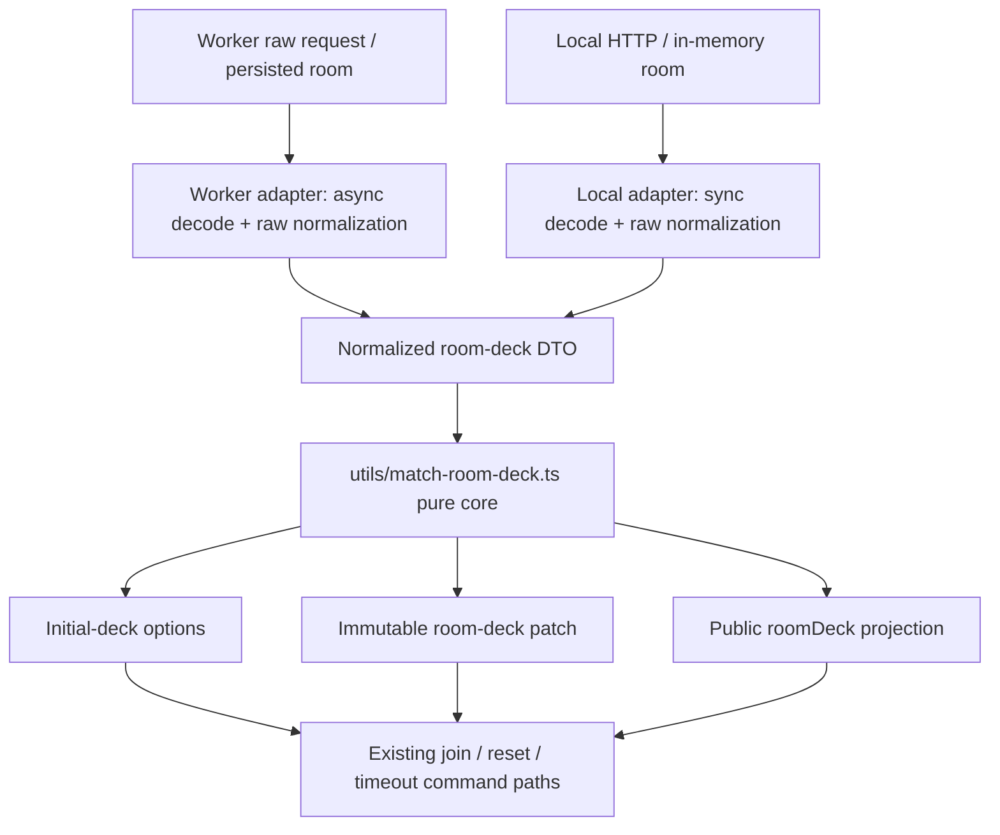

# Worker/local room-deck contract convergence design

- Status: implementation in progress; start gate and characterization complete
- Date: 2026-08-09
- Document role: Worker / local server 間に重複している room deck・初期デッキ変換を、挙動を維持しながら一つの純粋 authority helper へ収束させる設計正本
- Target: `workers/match-worker.ts` と `scripts/local-match-server.ts` の `roomDeck`、`initialDeck*`、デッキ変更、再戦初期化、公開 projection に関する純粋変換
- Sources of truth: `01-rulebook.md` §4.1、root / nested `AGENTS.md`、`docs/architecture-contracts.md` §§5.2, 8.1–8.8, 11–13、現行 root 実装、本文に記載する focused tests
- Player-visible specification: unchanged
- Network wire / saved-data format: unchanged

## 1. Problem and desired outcome

Worker と local match server は、同じ room deck 契約を外部へ提供しているにもかかわらず、初期デッキ入力の複製、全カードデッキ metadata、席別デッキ更新、再戦用初期化 option、公開 `roomDeck` projection をそれぞれ実装している。

同名の deck 関数だけで次の重複がある。

| Cluster | Worker | Local | Total |
| --- | ---: | ---: | ---: |
| 同名10関数 | 217行 | 216行 | 433行 |
| runtime 固有の `resolveDeckSelection` を除く9関数 | 179行 | 195行 | 374行 |

この並立は、正常系では同じ結果を返す一方、空配列、部分的 metadata、文字列の trim、deck size の数値化、既存 `roomDeck` の正規化で既に差がある。したがって、一方をもう一方へコピーするだけでは local / Worker parity を改善せず、隠れた互換挙動を変える危険がある。

望ましい結果は次のとおり。

1. raw HTTP / Durable Object / local in-memory room の差は runtime adapter が引き受ける。
2. 正規化済み DTO 以降の metadata 構築、席別更新、初期化 option、公開 projection は `utils/` の一つの純粋 owner が決める。
3. create、join、deck update、reset / rematch、timeout rebuild、state、spectator、publish / SSE の既存結果、version、保存・broadcast 順序を変えない。
4. 0枚を許すカスタムデッキと「値が存在しない」状態を truthiness で混同しない。
5. 将来の room deck 変更は Worker と local server の二箇所へ同じ分岐を追加せずに済む。

## 2. Evidence base

### 2.1 Repository evidence

- `docs/architecture-contracts.md` §13 は、local server と Worker に残る network constants / contract logic の重複を既知 debt としている。
- `docs/implementation/full-regression-contract-convergence-design.md` §3 は、room-deck metadata と initial-deck projection の共通化を次の network 候補として明記している。
- `workers/match-worker.ts:1151-1406` と `:1524-1561` が Worker 側の主要 cluster である。
- `scripts/local-match-server.ts:315-478` と `:878-955` が local 側の主要 cluster である。
- `utils/match-join-controller.ts`、`match-room-preferences-controller.ts`、`match-publish-controller.ts`、`match-state-controller.ts`、`match-spectate-controller.ts` は既に runtime 固有関数を capability として受け取る。controller API を変えず、capability の実装 owner だけを共有化できる。
- `utils/match-runtime-ports.ts` の command runtime は `MatchCommandInitialDeckOptions` を受け取るだけである。今回の責務は command execution より外側の room-to-options projection であり、`utils/match-command-runtime.ts` へ移さない。

### 2.2 Current behavior coverage

設計時に次を実行し、現行 valid-path baseline を確認した。

```text
npx jest --runInBand --runTestsByPath \
  test/workers.match-room-deck.test.ts \
  test/local-match-server.room-deck.test.ts
```

Result: 2 suites / 9 tests passed in 5.527 seconds.

既存 coverage は次を含む。

- 両席 default deck;
- 両席 all-cards deck;
- 片席・両席 custom deck の create / join / state projection;
- deck update 後の `reset_game`;
- room deck を使う timeout turn-start rebuild;
- Worker の create / join / state と local server の real HTTP path.

### 2.3 Proven semantic differences

| Input / operation | Worker today | Local today | Design treatment |
| --- | --- | --- | --- |
| `initialDeckCardIdsByPlayer.black = []` | `null` へ畳む | `[]` を保持 | raw adapter 差として characterization し、core は `[]` と absent を区別する |
| partial / malformed `roomDeck` | `normalizeRoomDeckMetadata()` を通す | raw metadata を概ね clone | adapter normalization に残し、core へ raw object を渡さない |
| direct successful selection DTO `deckCode` | trim して保存 | DTO 値を直接保存 | public resolver は両者とも canonical code を作る。raw capability 差は adapter characterization に残す |
| direct successful selection DTO `deckSize` | non-negative integer / `null` に正規化 | DTO 値を直接保存 | public resolver の valid result は不変。raw capability 差を記録したうえで normalized DTO を作る |
| `initialDeckSpecByPlayer` | 各 seat が object の時だけ clone | raw seat truthiness を先に見る | raw adapter に残し、core の seat map は明示的 `object | null` とする |
| non-empty unknown `roomDeck.mode` | supported union へ正規化 | raw mode 文字列を公開 | local の名前付き malformed-only compatibility fallback に残し、canonical DTO へ入れない |

この差があるため、実装は必ず characterization-first とする。malformed internal state を「どちらかへ寄せる」ことは本設計の完了条件ではない。

## 3. Scope, constraints, and non-goals

### 3.1 Implementation start gate

設計時点では、`docs/implementation/full-regression-contract-convergence-plan.md` の Step 9 が未完了であり、同文書には既存の Worker preload-order failure も記録されている。

実装を開始してよいのは、次をすべて満たした後だけである。

1. full-regression convergence Step 9 が verified / committed と記録され、作業ツリーが clean である。
2. `CardMarkers` preload-order defect が別の小さな task で修復されている。
3. `npm run worker:bundle:smoke` が現行 baseline で pass する。
4. 本文書と対応 plan 以外に、対象ファイルへ重なる未コミット変更がない。

この start gate は room-deck refactor に preload 修復を混ぜる許可ではない。gate が赤い場合は、その owner task を完了させてから再開する。

### 3.2 In scope

- Worker / local の current behavior を共通 fixture で characterization する。
- `utils/match-room-deck.ts` を authority-portable な純粋 owner として追加する。
- normalized seat map、room deck metadata、deck selection、initial-deck source / options、public projection の型を同 module に置く。
- normalized DTO 以降の metadata construction、selection application、initial options、public projection を共通化する。
- Worker と local の既存 controller capability 名を薄い adapter として維持する。
- generic 型を Worker 固有型から切り離し、`workers/match-worker-types.ts` は必要なら type alias / import で互換名を保つ。
- single-owner structural guard と focused parity coverage を追加する。
- 完了後に `docs/architecture-contracts.md` の stable owner と §13 debt を更新する。

### 3.3 Non-goals

- `resolveDeckSelection` の統合。Worker は async runtime loading、local は sync module access を維持する。
- deck codec、deck specification、0–30枚ルール、default / all-cards / CPU 専用 deck の仕様変更。
- HTTP route、Durable Object storage、local `Map`、SSE、session、seat token、`operationId`、`stateVersion` の変更。
- `roomDeck` wire shape、保存済み Worker room shape、deckCode、asset key の migration。
- malformed / partial raw state の全 runtime 統一。差は明示的 adapter behavior として残す。
- browser client、deck builder UI、rulebook、`正本/*.md` の変更。
- `workers/match-worker.ts` や `scripts/local-match-server.ts` の一般的な巨大ファイル分割。
- Worker preload-order defect の修復、deployment、本番データ更新。

## 4. Candidate comparison

| Candidate | Effect | Safety now | Difficulty | Decision |
| --- | ---: | ---: | ---: | --- |
| Worker/local room-deck pure core | 5/5 | 4/5 after characterization | 3/5 | **Selected** |
| Worker preload-order repair | 4/5 | 4/5 | 2/5 | 必須の別 task。corrective repair であり今回の structural refactor へ混ぜない |
| `cards.ts` の「反転の意志」single owner 化 | 3/5 | 3/5 | 3/5 | multi-cell / protection 差を先に設計する必要があり次点 |
| Pixi source-trajectory lifecycle 抽出 | 4/5 | 2/5 | 5/5 | Single Visual Writer / recovery / resource lease に直結するため延期 |
| generic global resolver の一括整理 | 3/5 | 1/5 | 5/5 | runtime load-order compatibility の positive proof が不足するため除外 |

room-deck core は、既知 debt と直前の独立調査の両方に一致し、正常系の実 API coverage がある。さらに UI、カード outcome、盤面 writer、publish idempotency の owner を動かさずに効果を得られるため、現在の第一候補とする。

## 5. Selected architecture



### 5.1 Canonical owner

`utils/match-room-deck.ts` owns only runtime-portable, synchronous, deterministic transformations. It imports no Worker class, local server, request/response, storage, browser global, timer, random source, or UI module.

The core API is fixed conceptually as follows. Exact symbol spelling may follow nearby style, but responsibilities and input boundaries must not change.

```ts
type MatchRoomDeckSeatKey = 'black' | 'white';

interface MatchRoomDeckSeatMap<T> {
  black: T;
  white: T;
}

interface MatchRoomDeckMetadata {
  mode: 'shared' | 'perPlayer';
  source: string;
  deckCode: string;
  deckSize: number | null;
  deckCodeByPlayer: MatchRoomDeckSeatMap<string>;
  deckSizeByPlayer: MatchRoomDeckSeatMap<number | null>;
}

interface MatchRoomDeckSelection {
  ok: true;
  hasCustomDeck: boolean;
  deckSpec: unknown | null;
  deckCode: string;
  deckSize: number | null;
}

interface MatchRoomDeckSelectionPatch {
  initialDeckSpec: null;
  initialDeckSpecByPlayer: MatchRoomDeckSeatMap<unknown | null> | null;
  roomDeck: MatchRoomDeckMetadata | null;
}
```

The module owns these operations:

1. clone already-normalized seat deck IDs and deck specs without sharing mutable arrays / objects;
2. construct all-cards metadata from explicit per-seat card arrays;
3. classify all-cards room state from normalized flags / metadata;
4. build `MatchCommandInitialDeckOptions` from a normalized source and an explicitly supplied resolved `boardConfig`;
5. calculate a room-deck selection patch from current normalized state, canonical seat, and successful selection;
6. project public `roomDeck` from normalized metadata plus snapshot deck-size facts;
7. normalize the exact scalar deck-size rule already shared by both runtimes.

Every core operation accepts only its declared normalized types. A `null` result represents a valid domain state only where the signature explicitly permits absence, such as no public room-deck metadata. If a JavaScript caller bypasses the TypeScript boundary with a structurally invalid normalized DTO, the operation throws `TypeError`; it does not coerce the value, return a success-shaped fallback, or reinterpret an unknown mode. Adapters validate raw input before the call.

### 5.2 Raw adapter boundary

Worker and local retain only the behavior that cannot be proven identical on raw values.

- Worker keeps async `loadDeckModules()` and async `resolveDeckSelection()`.
- Local keeps sync `DeckCodecModule` / `DeckSpecHelpers` use and sync `resolveDeckSelection()`.
- Each adapter validates `unknown` room fields and converts them into the core DTO.
- Current Worker persisted-room normalization remains byte-for-byte compatible.
- Current local raw behavior is characterized before migration. Any retained difference must be named in the adapter; it must not be hidden inside the shared core.
- A non-empty local `roomDeck.mode` other than `shared` / `perPlayer` uses the local malformed-compatibility projection `projectLegacyUnknownModeRoomDeck()`. That branch preserves the current local raw-mode output and is the only allowed projection exception. It must run before canonical DTO construction, accept no supported mode, and remain covered by a dedicated characterization test. Worker continues to normalize the same raw case through its existing adapter behavior.
- The core receives a canonical `'black' | 'white'`; player / seat parsing stays with existing authority helpers.
- `MatchAuthority.resolveRoomBoardConfig()` stays outside the core. Its result is passed explicitly when initial options are built.

The adapter wrappers may keep the current capability names `assignRoomDeckSelection`, `buildInitialDeckSnapshotOptions`, `isAllCardsDeckRoom`, and `toPublicRoomDeck` so the shared controllers do not churn. `assignRoomDeckSelection` applies the returned patch synchronously as one unit before the existing `updatedAt`, save, and broadcast sequence.

### 5.3 Empty versus absent

The rulebook permits a 0-card custom deck. The core must therefore never use a generic truthiness test to equate these states:

- `undefined` / `null`: no explicit value;
- `[]`: explicit empty card list;
- an empty but valid deck spec object: explicit 0-card custom deck;
- a non-empty list/spec: explicit custom or all-cards deck.

Raw adapters may preserve their currently characterized treatment of internal `initialDeckCardIdsByPlayer: []`, but once a DTO contains `[]`, the core clones and retains it. Custom 0-card deck specs must survive create, join, reset, and rebuild.

### 5.4 Pure selection update

The core does not mutate a room object. It returns a complete patch containing:

- cloned per-seat specs with only the selected seat changed;
- `initialDeckSpec: null` because the room has become per-seat;
- normalized per-seat metadata;
- `roomDeck: null` only when no shared or per-seat metadata entry remains.

This preserves the current external ordering while preventing a partial mutation if normalization fails. Worker / local adapters apply the patch before their existing save and presence broadcast.

### 5.5 Public projection

`projectPublicRoomDeck()` receives no private deck spec and cannot serialize it. Its inputs are limited to:

- normalized `roomDeck` metadata or `null`;
- `initialDeckSizeByPlayer.black / white` facts;
- fallback `initialDeckSize`.

It returns the existing shapes only:

- shared: `mode`, `deckCode`, `deckSize`, `source`;
- per-player: the shared summary plus `deckCodeByPlayer` and `deckSizeByPlayer`.

Black, white, and spectator routes reuse the same public room metadata. Viewer-specific card hands remain owned by snapshot projection and are unaffected.

The local adapter's named unknown-mode compatibility branch is intentionally outside `projectPublicRoomDeck()`: an arbitrary raw mode cannot satisfy `MatchRoomDeckMetadata`. Empty mode and all supported valid metadata are normalized and delegated normally. No other malformed projection fallback is permitted without revising this design.

## 6. Data and control flow

### 6.1 Create

1. adapter decodes the optional deck code using its current sync / async mechanism;
2. adapter converts successful output to normalized selection DTO;
3. core returns the initial room-deck patch;
4. adapter builds initial deck options with resolved board config;
5. existing game/card state factory creates canonical private state;
6. existing projection returns `roomDeck`; state version remains the current create value.

### 6.2 Join and deck update

1. existing authentication and seat resolution complete first;
2. all-cards rooms continue to ignore seat deck updates;
3. adapter decodes the deck and supplies canonical seat + selection to the core;
4. core returns a patch; adapter applies it synchronously;
5. join may rebuild the initial snapshot under its existing two-seat / version-zero condition;
6. deck preference update still does not rewind the active match and broadcasts presence only when public metadata changes.

### 6.3 Reset / rematch / timeout rebuild

1. existing authority path calls adapter `buildInitialDeckSnapshotOptions(room)`;
2. adapter supplies normalized deck source and board config to the core;
3. existing `makeInitialSnapshot()` / shared command runtime consumes the returned options;
4. publish idempotency, `operationId`, version increment, presentation frame, persistence, response, and SSE remain in their current owners.

### 6.4 State, spectator, stream, and publish projection

Every path continues to call adapter `toPublicRoomDeck(room)`. The adapter prepares normalized metadata / snapshot size facts and delegates to the core. No private `initialDeckSpec*`, seat token, identity secret, canonical hash, or hidden hand is added to public payloads.

## 7. Compatibility and failure behavior

### 7.1 Valid behavior

The following are strict invariants:

- default / one-seat custom / two-seat custom / all-cards results stay unchanged;
- deck update affects the next reset / rematch, not the current hand or deck;
- 0-card custom deck remains valid;
- each runtime retains its sync / async decode boundary and error code;
- invalid deck code remains `DECK_CODE_INVALID` through the existing 400 response;
- no state-version increment or idempotency behavior moves into the helper;
- `source: 'allCards'` continues to override seat-local deck choices;
- fresh arrays and cloned specs are returned so room and snapshot state do not share mutable input objects.

### 7.2 Partial or malformed internal input

Characterization fixtures record Worker and local results separately before source movement. The implementation may share only a branch whose expected result is already equal, or after an explicit adapter converts the raw difference to the same normalized DTO without changing its recorded output.

The known local non-empty unknown-mode result is preserved by the single adapter-only compatibility branch defined in §5.2 / §5.5. It is not evidence that the canonical core should accept arbitrary modes. All other values passed to the core must satisfy the normalized DTO, and a structurally invalid DTO is a programmer error that throws `TypeError`.

If a difference would change Worker saved-room compatibility or a supported public result, stop and revise this design rather than selecting a winner during implementation.

### 7.3 Errors

- Raw parsing / validation errors remain adapter errors.
- The pure core must not catch arbitrary exceptions and return success-shaped defaults.
- Invalid normalized DTOs throw `TypeError`; `null` is reserved for declared domain absence and is never an invalid-input sentinel.
- A failed patch calculation leaves the original room untouched.
- Missing required normalized fields fail explicitly in focused tests; they are not inferred from unrelated snapshot state.

## 8. Security, privacy, performance, and concurrency

### Security and privacy

- The helper has no access to seat tokens, player tokens, recovery codes, storage, request headers, or logs.
- Public projection accepts size facts and public metadata only; it never receives private deck specs.
- Existing spectator read-only and seat authentication boundaries remain unchanged.

### Performance

- Operations are bounded by two seats and small metadata objects.
- Cloning remains equivalent to current behavior; no whole snapshot scan is introduced.
- The refactor removes repeated normalization / projection work implementations but does not claim a measurable frame-time or request-latency gain.

### Concurrency

- The core is synchronous and stateless.
- Async module loading completes before the Worker calls the core.
- Adapters apply one complete patch before existing save / broadcast calls.
- No new timer, listener, Worker, Promise owner, queue, or retry path is introduced.

## 9. Documentation, generated output, and runtime implications

- `01-rulebook.md` and `正本/*.md` stay unchanged because no player-visible deck rule changes.
- After implementation, `docs/architecture-contracts.md` must name `utils/match-room-deck.ts` as the single owner of normalized room-deck mutation, initial options, and every supported public projection.
- The same stable contract must name the local adapter as owner of raw validation / normalization and the sole `projectLegacyUnknownModeRoomDeck()` fallback for non-empty unsupported modes. It must state that this malformed compatibility branch is outside the normalized projection contract and that Worker retains its existing normalization instead.
- §13 must be narrowed: Worker/local deck decode and transport remain runtime-specific, but normalized room-deck contract logic is no longer duplicated debt.
- Root TypeScript is canonical. `dist/`, browser output, and `worker-public/` are generated only through repository scripts.
- The new helper is a static authority dependency. It must not be added as a browser global or a second Worker runtime-global registry entry unless the actual import graph proves that is required; normal design is a static import from the adapters.
- No deployment is part of this task.

## 10. Verification strategy

### 10.1 Start-gate proof

- clean `git status --short`;
- full-regression Step 9 recorded complete;
- baseline `npm run worker:bundle:smoke` passes before room-deck source edits.

### 10.2 Characterization and unit proof

- shared fixture matrix covers default, all-cards, one-seat custom, two-seat custom, 0-card custom, deck update, reset, timeout rebuild, empty arrays, partial metadata, malformed sizes/codes, and null state;
- the local non-empty unknown-mode projection and Worker normalization of the same raw case are recorded separately before extraction;
- current Worker and local external paths pass before extraction;
- new pure helper tests prove cloning, patch immutability, empty/absent distinction, metadata pruning, and public projection.

### 10.3 Runtime proof

- `test/workers.match-room-deck.test.ts`;
- `test/local-match-server.room-deck.test.ts`;
- new Worker/local room-deck parity suite;
- `test/match-room-preferences-controller.authority.test.ts`;
- `test/match-join-controller.authority.test.ts`;
- `test/match-publish-controller.authority.test.ts`;
- `test/match-state-controller.authority.test.ts`;
- `test/match-spectate-controller.authority.test.ts`;
- affected local publish / spectator and Worker rematch / spectator / stream tests.

### 10.4 Structural and delivery proof

- typecheck and TypeScript build;
- AST-based structural guard proves canonical transforms are declared only in `utils/match-room-deck.ts` and both adapters delegate;
- `npm run test:match:parity`;
- `npm run test:network:parity`;
- `npm run worker:prepare`;
- `npm run check:worker-mirror`;
- `npm run worker:bundle:smoke`;
- `npm run checkall`;
- full `npm run test:jest` green-to-green run.

Browser operation is not required unless implementation evidence reveals a client-visible payload change. No UI or board rendering path is designed to change.

## 11. Risks and mitigations

| Risk | Mitigation |
| --- | --- |
| Hidden Worker/local semantic difference is erased | Characterization is a mandatory first commit; raw differences remain adapter-owned |
| 0-card deck is collapsed to default | DTO and tests distinguish `[]`, valid empty spec, and absent value |
| Private deck spec leaks through shared projection | Public projection API cannot accept specs; black/white/spectator payload tests inspect absence |
| Room mutates partially before a failure | Core returns an immutable patch; adapter applies only after success |
| Shared helper becomes a new giant authority object | Limit it to deck metadata/options/projection; no HTTP, storage, codec, version, or presentation ownership |
| Worker bundle passes source tests but fails executable load | Start gate and final `worker:bundle:smoke` are both mandatory |
| Generated output overlaps another task | Start only from clean status and run generation after focused tests |
| Structural test becomes move-hostile | Parse declarations/imports with TypeScript AST; do not assert arbitrary source prefixes or line positions |

## 12. Completion conditions

- A common characterization matrix exists and records every known raw semantic difference before extraction.
- `utils/match-room-deck.ts` is the only owner of normalized metadata construction, selection patch calculation, initial option projection, and supported public room-deck projection.
- Worker / local adapters retain only decode, raw normalization, transport/storage, and thin patch/application wiring.
- The sole local unknown-mode compatibility projection remains named, malformed-only, and characterization-covered; every supported projection delegates to the core.
- `resolveDeckSelection` remains runtime-specific and no second generic loader is introduced.
- Valid create, join, deck update, reset/rematch, timeout rebuild, state, spectator, publish, and stream behavior is unchanged.
- Empty / absent values and valid 0-card custom decks are explicitly covered.
- `stateVersion`, `operationId`, idempotency, save/broadcast, privacy, and viewer projection contracts are unchanged.
- Player specification, wire schema, and saved Worker room schema are unchanged.
- Focused, parity, structural, build, mirror, executable Worker smoke, `checkall`, and full Jest gates pass.
- Architecture contracts describe the new owner and no generated or mirror file is source-edited.
- Final task-owned diff is committed in coherent units with unrelated work untouched.

## 13. Self-review

The first investigation considered repairing Worker preload order as the primary task because it is small and immediately blocks bundle smoke. Review showed that it is a corrective delivery defect, while room-deck duplication is the repository's explicitly identified next structural debt with 374 lines of non-codec duplication. The preload repair is therefore a hard start gate and separate owner task, not mixed into this refactor.

The first room-deck direction proposed moving the Worker implementation wholesale into `utils/`. Direct comparison found real differences for empty arrays, partial metadata, trim, size normalization, and seat-spec guards. The design was revised to put raw normalization in adapters and share only normalized DTO transformations. This makes the safety claim evidence-based rather than assuming the Worker implementation is automatically correct for every local compatibility input.

Self-review also found that ordinary truthiness would break the rulebook's valid 0-card custom deck. Empty arrays and empty-but-valid deck specs are now explicit contract cases, and the pure patch is non-mutating so a failed conversion cannot leave half-updated room state.

Finally, the scope was checked against network authority: the helper owns no authentication, version, operation identity, persistence, projection-by-viewer, SSE, or presentation work. Existing controllers and their capability names remain stable, leaving no architectural choice for the implementation model beyond local symbol naming.

Independent review found one raw case that the first DTO could not represent: local currently echoes a non-empty unknown `roomDeck.mode`, while Worker normalizes it. The design now keeps that exact malformed-only behavior in one named local adapter branch and makes invalid core DTO handling unambiguous (`TypeError`, never `null`). This avoids either widening the canonical union with unsupported values or silently changing local compatibility output.
