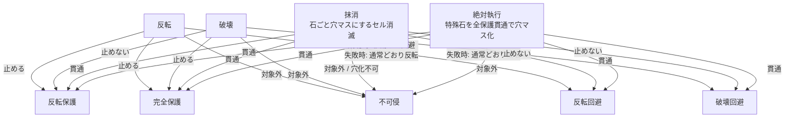

# 耐性・貫通関係図

## 文書の役割

- 目的: `反転保護` / `完全保護` / `不可侵` / `反転回避` / `破壊回避` / `破壊` / `抹消` / `絶対執行` の関係を、実装・UI文言確認用に早見できる形へ整理する。
- 対象: 既存仕様の読み替え補助。カード説明、効果タグ、石情報、実装レビュー時の判断材料。
- 正本: `01-rulebook.md`。この文書は仕様変更を行わない。
- 非対象: 新ルールの提案、カード性能調整、実装方針の変更。

## レイヤー早見図

## 判定マトリクス

| 効果 | 反転保護 | 完全保護 | 不可侵 | 反転回避 | 破壊回避 |
| --- | --- | --- | --- | --- | --- |
| 反転 | 防ぐ | 防ぐ | 対象外 | 成功時は移動して回避。空きが無い時は失敗 | 関係なし |
| 破壊 | 防げない | 防ぐ | 対象外 | 関係なし | 成功時は移動して回避。空きが無い時は失敗 |
| 抹消 | 貫通 | 貫通 | 対象外 / 穴化不可 | 防げない | 防げない |
| 絶対執行 | 貫通 | 貫通 | 対象外 | 貫通 | 貫通 |

## 読み方

- `反転保護` は反転専用。破壊・抹消は止めない。
- `完全保護` は石に対する敵対的・強制的な効果を止めるが、抹消や盤面縮小のようなマス破壊は貫通する。
- `不可侵` は顕現石や森羅万象神を盤面干渉効果の対象から外す保護。抹消系や絶対執行でも不可侵の石があるマスは対象外または不発になる。
- `反転回避` / `破壊回避` は、対応する効果を受ける時だけ移動で避ける。成功時だけ回数を消費し、空きマスが無い時は回避不成立。
- `抹消` は石破壊を伴うセル消滅として扱うが、通常の破壊耐性では止まらない。
- `絶対執行` は盤界の執行者専用の抹消。特殊石に対して不可侵以外の保護を貫通する。不可侵の特殊石・顕現石・石状態・盤面マーカー・配置時効果は対象に含まない。

## 根拠

- `01-rulebook.md` 6.4: 完全保護は敵対的・強制的な石効果を無効化し、因果抹消 / 因果抹消神 / 盤面縮小 / 盤面縮小神のマス破壊は貫通する。
- `01-rulebook.md` 6.6.2: 反転回避 / 破壊回避は移動して避け、移動先で挟める列があれば反転する。
- `01-rulebook.md` 6.8: 顕現石は通常カード効果の対象外。効果本文で明示された場合だけ例外。
- `01-rulebook.md` 10.23.1.2: 盤界の執行者は盤面上の不可侵ではない特殊石を絶対執行し、不可侵以外の保護を貫通して穴マスにする。
- `01-rulebook.md` 10.28.3 / 10.31.1 / 10.32.1: 抹消・盤面縮小はセル消滅で、完全保護や回避では止まらず、不可侵の石は対象外または不発。
- `shared/game-term-glossary.ts`: UI用語説明は、破壊・抹消・絶対執行・不可侵・反転保護・完全保護・反転回避・破壊回避の説明を共有する。
